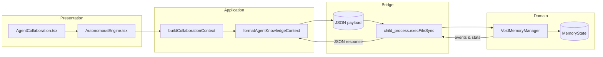

# Void Dynamics Memory System Guide

The Void Dynamics learning graph coordinates long-term retrieval for the collaborative physicist agents. This guide explains
how the Python memory manager interoperates with the TypeScript collaboration pipeline, outlines verification workflows, and
documents migration expectations for existing deployments.

## Core Components

- **Python Domain & Business Logic**
  - `VoidMemoryManager`: orchestrates chunk registration, reinforcement, pruning, and diffusion.
  - `MemoryState`: tracks confidence, novelty, boredom, inhibition, and persistence metadata for each chunk.
  - `territories`: assigns embeddings to deterministic territories, handles splitting/merging, and records neighborhood stats.
  - `persistence`: serialises and restores manager state via JSON payloads.
- **TypeScript Presentation & Application Layers**
  - `buildCollaborationContext`: assembles recent exchanges and knowledge entries into ranked documents for prompting.
  - `formatAgentKnowledgeContext`: produces focus digests and graph insights for the LLM-facing prompt surface.
  - `autonomous-utils`: safeguards multi-turn execution by validating completions and structured responses.

These layers communicate through JSON payloads so the React presentation tier never depends on the Python implementation.

## Cross-Language Interaction Flow

The TypeScript application code serialises collaboration artefacts, ships them to a Python process, and consumes the resulting
events, reward signals, and lifecycle metrics. This approach honours the hybrid-clean architecture rule: presentation depends on
application services, which talk to domain logic through process boundaries.

## Integration from TypeScript

The `tests/e2e/void-integration.test.ts` fixture demonstrates the recommended integration path:

1. Build the collaboration query using `buildCollaborationContext`.
2. Select the ranked documents you want to reinforce.
3. Spawn a Python worker with `child_process.execFileSync`, injecting `PYTHONPATH` so `src/void_dynamics` resolves.
4. Submit the documents as JSON, letting Python register or reinforce the memories.
5. Parse the resulting JSON to obtain reinforcement deltas, TTL adjustments, and aggregation stats for the agents.

When embedding this into production, wrap the bridge in an infrastructure adapter that manages the worker pool and exposes a
narrow interface to the application layer.

## Performance & Benchmarking

Use the following workflow to characterise reinforcement quality and memory pressure:

- **Stress registration**: feed ~1,000 synthetic documents with varying novelty to confirm territory growth stays below
  capacity limits and that eviction only occurs for cold, low-confidence chunks.
- **Reinforcement soak**: repeatedly reinforce a 32-document batch while tracking the emitted heat and confidence deltas. The
  reward EMA should approach the similarity average, confirming exponential smoothing behaves.
- **Decay cadence**: advance the manager tick without new data to ensure heat, boredom, and TTL decay follow configured
  half-lives and that no events fire unexpectedly.
- **Profiling hooks**: wrap `_decay_pass`, `_prune_if_needed`, and `_maybe_diffuse` calls with `time.perf_counter()` or the
  `cProfile` module to record hot spots. For TypeScript callers, measure round-trip latency per bridge invocation and keep it
  under the agent turn SLA.

Document the captured metrics in your observability stack so drifts in reinforcement behaviour surface quickly.

## Migration Path

Existing deployments should:

1. Run `node scripts/migrate-autonomous-config.mjs <path/to/runtime.config.json>` to update autonomous defaults and align with
the persistence layout.
2. Export any legacy memory stores, then pipe them through `python -m src.void_dynamics.persistence --migrate <path>` once such
   tooling is provided. The current manager accepts persistence version `1` and will emit lifecycle events if a future upgrade is
   required.
3. Wire the new Node↔Python bridge into the infrastructure layer so application services invoke it instead of legacy memory
   shims.
4. Execute the Vitest and Python suites (now exercised in CI) to validate the deployment.

By following these steps, contributors gain reproducible reinforcement, deterministic territories, and documented touchpoints
between the presentation and domain layers.
